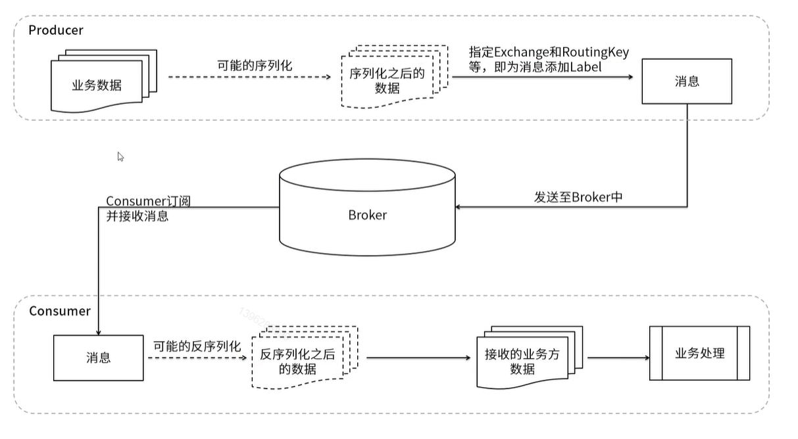
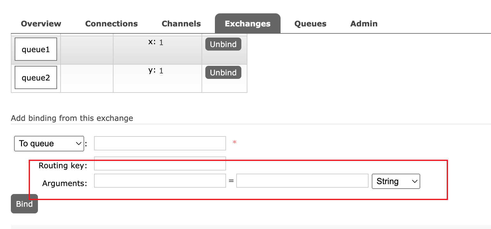

## 基本使用
1. rabbitmqctl list_queues 查看所有队列
2. rabbitmqctl delete_queue queue_name 根据 queue_name 参数，删除对应的队列
> mq 流程


> 交换机共有四种类型
* 广播(fanout) [fanout代码](https://github.com/mr-zxy/NetworkSecurityDocs/tree/main/RabbitMQ/code/mqJava/fanout)
* 路由(direct) [direct代码](https://github.com/mr-zxy/NetworkSecurityDocs/tree/main/RabbitMQ/code/mqJava/direct)
* 主题(topic) [topic代码](https://github.com/mr-zxy/NetworkSecurityDocs/tree/main/RabbitMQ/code/mqJava/topic)
* 标题(headers) [headers代码](https://github.com/mr-zxy/NetworkSecurityDocs/tree/main/RabbitMQ/code/mqJava/headers)
* 消息模型(work) [work代码](https://github.com/mr-zxy/NetworkSecurityDocs/tree/main/RabbitMQ/code/mqJava/work)
* ttl [消息队列过期时间设置](https://github.com/mr-zxy/NetworkSecurityDocs/tree/main/RabbitMQ/code/mqJava/ttl)
* 死性队列 [死性队列-往下看](https://github.com/mr-zxy/NetworkSecurityDocs/blob/main/RabbitMQ/code/springBoot/DirectRabbitConfig.java)

1. fanout 广播模式 只要有一个订阅都会收到消息 
2. direct 路由模式 根据路由key进行匹配 
3. topic  主题模式 增加模糊匹配路由key 
    * \# 零个一个或多个 (com.xxx 对应 routing key com.#) 
    * \* 至少有一个,只有一级 
        + 例子 队列一 key *.course.* 队列2 #.order.# 对应 com.course.order 两个队列都可以收到
4. headers 参数模式 根据参数进行发送消息 
    
5. work消息模型【能者多劳】
6. 死性队列 
    * 设置ttl 没有消费者消费 过期会进入死性队列
    * 设置 x-max-length 超过了 会进入死性队列
    * 设置 channel.basicNack(deliveryTag, false, false) 拒绝接收会进入死性队列

> 消息不丢失 

1. 发布
 * channel.confirmSelect() 开启发送方确认模式 正常确认
 * 极端情况下，没有走confirmSelect方法，需要先数据存储到数据库或者存储到redis
2. 消费
    * 开启ack 自动确认机制，配合死性队列使用。如果消息过期或者报错，把数据添加到死性队列中，在进行发送。 或者配置重发次数参数。 

> 生产数据可靠性 通过 rabbitTemplate.setConfirmCallback 方法监听mq是否接收到消息。[生产SpringBoot代码](https://github.com/mr-zxy/NetworkSecurityDocs/blob/main/RabbitMQ/code/springBoot/OrderService.java)
```java
 @Autowired
    private RabbitTemplate rabbitTemplate;

    /**
     * 消息可靠性
     * spring:
     *   rabbitmq:
     *     host: 127.0.0.1
     *     password: admin
     *     username: admin
     *     publisher-confirm-type: correlated 需要配置此选项
     *     listener:
     *       type: simple
     *       simple:
     *         default-requeue-rejected: false
     *         acknowledge-mode: manual
     */
    @PostConstruct
    public void regCallback(){
        /**
         * @param correlationData 相关配置信息
         * @param ack   exchange交换机 是否成功收到了消息。true 成功，false代表失败
         * @param cause 失败原因
         */
        rabbitTemplate.setConfirmCallback((CorrelationData correlationData, boolean ack, String cause)->{
//            System.out.println("----");
            System.out.println("消息生产可靠性回调："+correlationData.getId());
//            System.out.println(ack);
//            System.out.println(cause);
//            System.out.println("----");
        });
    }
    @GetMapping("/message")
    public void makeOrder(String userId) {
        String orderNumer = UUID.randomUUID().toString();
        System.out.println("用户 " + userId + ",订单编号是：" + orderNumer);
        rabbitTemplate.convertAndSend(DEAD_BUSINESS_B_EXCHANGE_NAME, DEAD_BUSINESS_B_KEY_NAME, orderNumer,new CorrelationData(orderNumer));
    }
```
> 手动确认消费 保证消费准确性 使用 try catch + 手动确认 + 死性队列 [消费SpringBoot代码](https://github.com/mr-zxy/NetworkSecurityDocs/blob/main/RabbitMQ/code/springBoot/ConsumerDead.java)
```java
@RabbitListener(queues = DEAD_BUSINESS_B_QUEUEA_NAME)
@Component
public class ConsumerB {
    @RabbitHandler
    public void messagerevice(String message, Channel channel, @Header(AmqpHeaders.DELIVERY_TAG) long deliveryTag) throws IOException {
        try {
            /**
             * 消费数据
             * deliveryTag  设备id
             * multiple 参数设置为false 则表示拒绝编号为deliveryTag的这一条消息，这时候basicNack 和basicReject 方法一样;multiple 参数设置为true 则表示拒绝deliveryTag 编号之前所有未被当前消费者确认的消息。
             */
            channel.basicAck(deliveryTag, true);
            System.out.println("消费成功"+message);
        } catch (Exception ex) {
            System.out.println(ex);
            /**
             * 拒绝消费数据
             * deliveryTag  设备id
             * multiple 参数设置为false 则表示拒绝编号为deliveryTag的这一条消息，这时候basicNack 和basicReject 方法一样;multiple 参数设置为true 则表示拒绝deliveryTag 编号之前所有未被当前消费者确认的消息。
             * requeue:true为将消息重返当前消息队列,还可以重新发送给消费者;   false:将消息丢弃 如果有死性队列 会被丢入死性队列中
             */
            channel.basicNack(deliveryTag, false, false);
            System.out.println("消费失败"+message);
        }
    }
}
```
