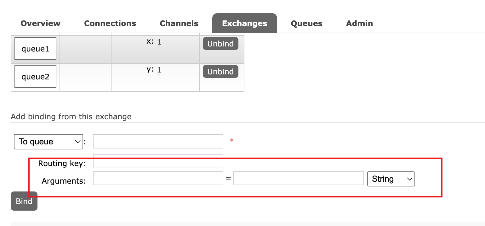

> 交换机共有四种类型
* 广播(fanout) [fanout代码](http://baidu.com)
* 路由(direct) [direct代码](http://baidu.com)
* 主题(topic) [topic代码](http://baidu.com)
* 标题(headers) [headers代码](http://baidu.com)
* 消息模型(work) [work代码](http://baidu.com)
* 死性队列 [死性队列-详见Spring-boot 整合](http://baidu.com)

1. fanout 广播模式 只要有一个订阅都会收到消息 
2. direct 路由模式 根据路由key进行匹配 
3. topic  主题模式 增加模糊匹配路由key 
    * \# 零个一个或多个 (com.xxx 对应 routing key com.#) 
    * \* 至少有一个,只有一级 
        + 例子 队列一 key *.course.* 队列2 #.order.# 对应 com.course.order 两个队列都可以收到
4. headers 参数模式 根据参数进行发送消息 
    
5. work消息模型【能者多劳】
6. 死性队列 
    * 设置ttl 没有消费者消费 过期会进入死性队列
    * 设置 x-max-length 超过了 会进入死性队列
    * 设置 channel.basicNack(deliveryTag, false, false) 拒绝接收会进入死性队列
