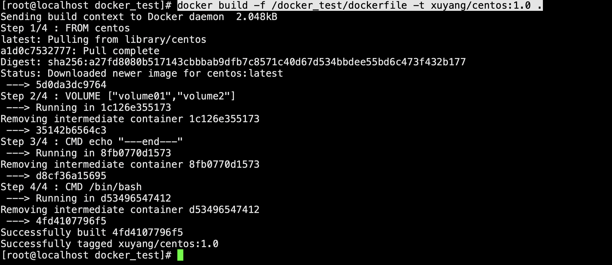
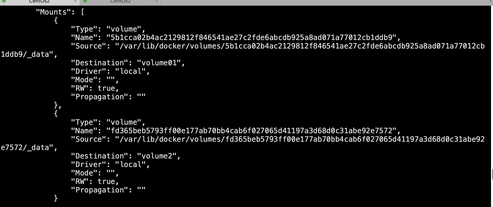

# docker 常用命令
## docker 安装详见 https://juejin.cn/post/6844903946062921741#heading-4
## docker hub https://hub.docker.com/
### 联合文件系统 分层下载
## 指令回答
1. docker it指的是啥 
   ``` dockerfile
    * -i：以交互模式运行容器
    * -t：为容器重新分配一个伪输入终端
   ```
## 镜像 
* docker ps 查看运行时镜像
* docker images 查看景象
* docker pull ngnix OR docker run -d nginx:latest 运行一个 nginx 如果没有会去镜像仓库下载
* docker run --name nginxtest -p 9091:80 -d nginx:1.17.8 运行一个容器
* docker run -it -d -p 8080:8080 tomcat
<!-- * docker run -it -d -p 8080:8080 tomcat2 /root/dockerStart/start.sh  -->
### 镜像删除
* #### docker images 查看docker 镜像
1. 方法一：删除时不要使用 image ID，改用镜像名称（REPOSITORY）
2. 方法二：docker rmi -f imageID
##  docker 系统指令
* 2.1 启动docker服务
* systemctl start docker
* 2.2 停止docker服务
* systemctl stop docker
* 2.3 重启docker服务
* systemctl restart docker
* 2.4 查看docker服务状态
* systemctl status docker
## 列出所有在运行的容器信息
docker ps [OPTIONS] 其他参数

* -a :显示所有的容器，包括未运行的。
* -f :根据条件过滤显示的内容。
* –format :指定返回值的模板文件。
* -l :显示最近创建的容器。
* -n :列出最近创建的n个容器。
* –no-trunc :不截断输出。
* -q :静默模式，只显示容器编号。
* -s :显示总的文件大小。

## docker 启动命令 

* docker container run --publish 80:80  --detach  nginx 
```
--detach  在后台运行
```
* docker ps  -a 显示所有的容器，包括未运行的。
* docker rm  CONTAINERID 删除进程
* docker stop CONTAINERID 关闭进程
* docker start CONTAINERID 关闭进程

# 命令
* docker logs -f -t --tail 10  CONTAINERId 查看运行日志
* docker top CONTAINERId 查看进程信息行
* docker inspect CONTAINERId 查看原数据,返回docker虚拟机详细信息
* docker cp CONTAINERId:/home/test.text /home 容器内拷贝到主机上
* docker image inspect nginx:latest 查看镜像分层方式

## 进入运行的容器
1. docker exec -it CONTAINERId /bin/bash 进入容器开启新的终端，可以在里面操作
2. docker attach CONTAINERId 进入容器正在执行的终端，不会启动新的终端


# 做自己的镜像
1. docker commit -m="描述信息" -a="作者" CONTAINERId 目标镜像名：[TAG]


# 容器数据卷
1. 什么是容器数据卷
    * 将环境和应用打包成一个镜像，数据持久化。
    * 数据共享技术，数据同步到本地。
``` dockerfile
docker run -it -v 主机目录:容器内目录 
```
# 具名和匿名挂载
1. 通过-v 
    * docker run -d -p --name nginx01 -v /etc/nginx nginx 匿名
    * docker run -d -p --name nginx02 -v xuyang-nginx:/etc/nginx nginx 具名  
    * docker volume ls 查看所有卷的情况
    * docker vloume inspect xuyang-nginx 查看指定卷内部信息
    ---
    可以通过一个具名挂载找到我们想要的一个卷，大多数使用“具名”。

# docker file 
## 创建容器卷的一种方法
1. 创建dockerfile 文件
    ``` dockerfile
    FROM centos
    VOLUME ["volume01","volume2"]
    CMD echo "---end---"
    CMD /bin/bash
    # 每个命令都是一层镜像
    ```
2. docker build -f /docker_test/dockerfile -t xuyang/centos:1.0 .

3. docker run -it -d CONTAINERID /bin/bash 启动镜像 
4. docker inspect CONTAINERID 查看卷挂载路径 


# 数据卷容器 
 ## desc 两个或多个之间实现数据共享
 ### 启动2个容器
 * docker run -it -name docker01 xuyang/centos:1.0 
 * docker run -it --name docker02 --volumes-from docker01 xuyang/centos:1.0 
 ---
 docker01更改同时也更改了docker02


6144605005a2

919b69690fee

71ee32519e38