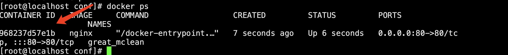

# * docker pull ngnix OR docker run -d nginx:latest 运行一个 nginx 如果没有会去镜像仓库下载

* docker container run --publish 80:80  --detach  nginx 
```bat
--detach  在后台运行
```
* docker ps 查看docker 进程
* docker stop CONTAINERID 关闭进程

1. 在浏览器输入http://ip:80 回车 看到“Welcome to nginx!” 字样说明已经可以访问到了

2. 由于直接命令安装ngnix的并不知道配置文件在何处，所以需要单独指定配置文件，具体操作如下
    * 1. 执行创建文件夹命令：
        ```
        mkdir -p /data/nginx
        mkdir -p /data/nginx/www
        mkdir -p /data/nginx/conf
        mkdir -p /data/nginx/logs
        ```
    * 2. 将相应的文件拷贝到对应文件夹下命令如下
        * docker cp 968237d57e1b:/etc/nginx/nginx.conf /data/nginx/
        * docker cp 968237d57e1b:/etc/nginx/conf.d /data/nginx/conf/
        * docker cp 968237d57e1b:/usr/share/nginx/html/ /data/nginx/www/
        * docker cp 968237d57e1b:/var/log/nginx/ /data/nginx/logs/
        </img>
3. 下次启动命令为
    ```
    docker run --name nginx -p 80:80 -v /data/nginx/nginx.conf:/etc/nginx/nginx.conf -v /data/nginx/www/:/usr/share/nginx/html/ -v /data/nginx/logs/:/var/log/nginx/ -v /data/nginx/conf/:/etc/nginx/conf.d --privileged=true -d nginx
    ```
    

    docker cp af22ca700850:/etc/nginx/nginx.conf /data/nginx/
    docker cp af22ca700850:/etc/nginx/conf.d /data/nginx/conf/
    docker cp af22ca700850:/usr/share/nginx/html/ /data/nginx/www/
    docker cp af22ca700850:/var/log/nginx/ /data/nginx/logs/

    <!-- docker run --name nginx -p 80:80 -v /data/nginx/nginx.conf:/etc/nginx/nginx.conf -v /data/nginx/www/:/usr/share/nginx/html/ -v /data/nginx/logs/:/var/log/nginx/ -v /data/nginx/conf/:/etc/nginx/conf.d --privileged=true -d nginx -->
    

    docker run --name nginx -d -p 80:80 --restart unless-stopped  -v /data/nginx/nginx.conf:/etc/nginx/nginx.conf -v /data/nginx/www/:/usr/share/nginx/html/ -v /data/nginx/logs/:/var/log/nginx/ -v /data/nginx/conf/:/etc/nginx/conf.d --privileged=true -d nginx


